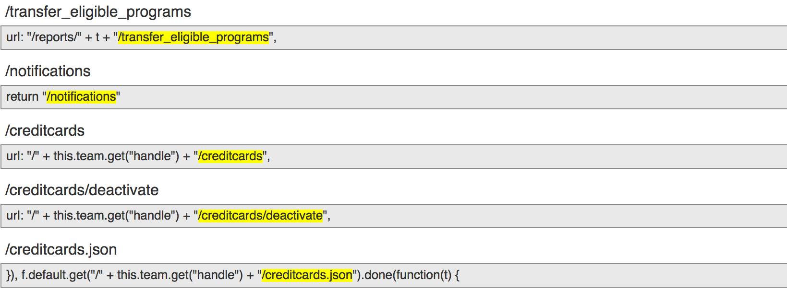
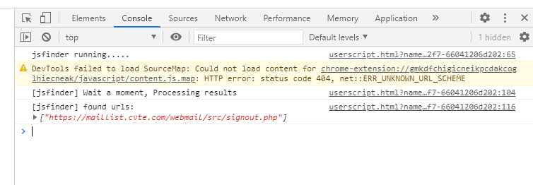
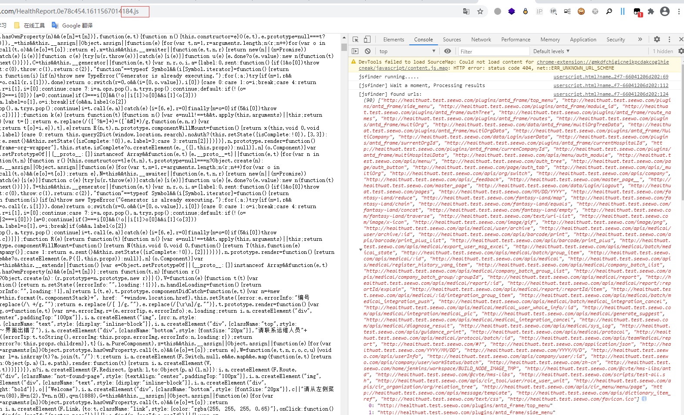

# jsfinder

从当前页面中的js文件中提取api

参考：https://github.com/Threezh1/Deconstruct/tree/main/DevTools_JSFinder

提取规则参考：https://github.com/GerbenJavado/LinkFinder

提取规则的匹配情况

# 使用

chrome安装Tampermonkey

然后添加js即可

使用范围：

1、正常网站页面

2、直接访问目标js，获取这个js的api

# 效果

1、正常网站

2、访问指定js

